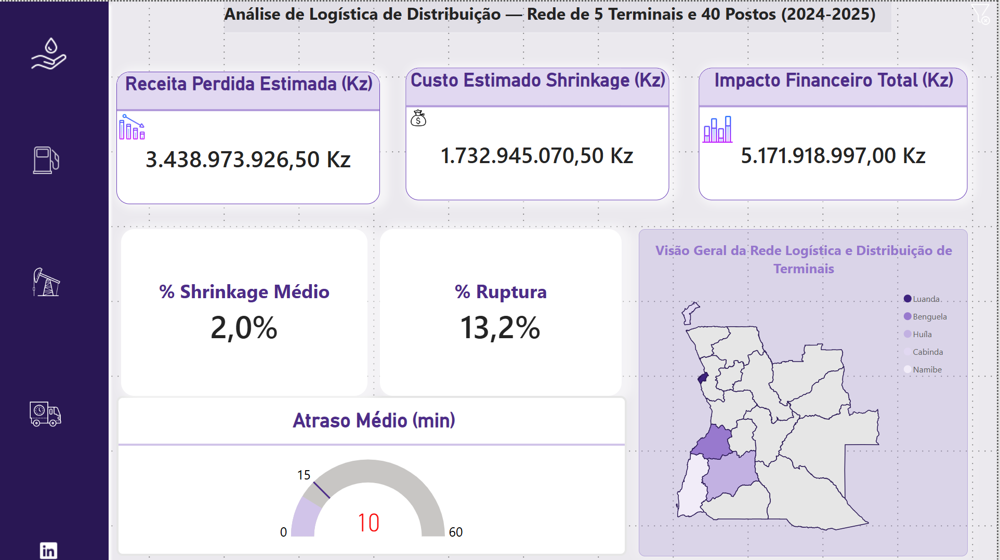
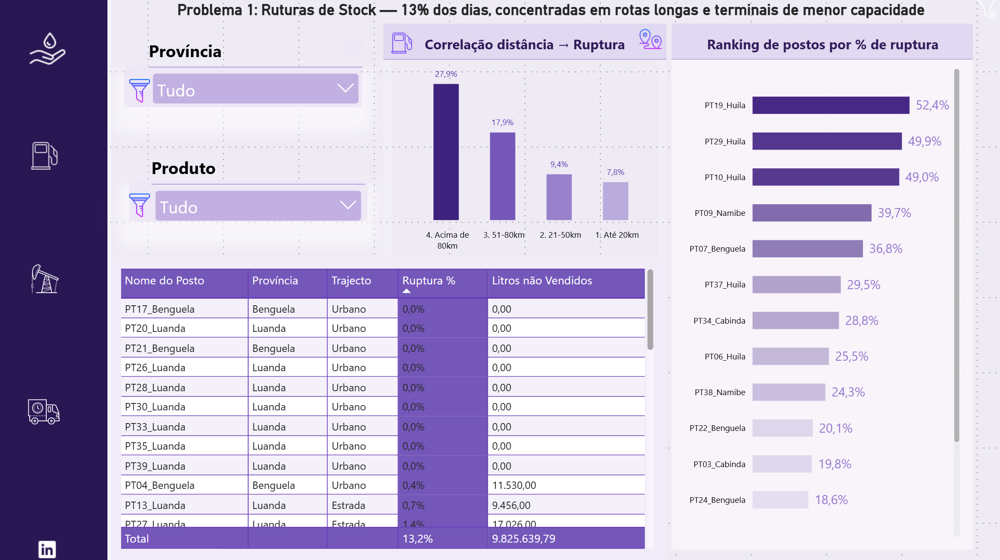
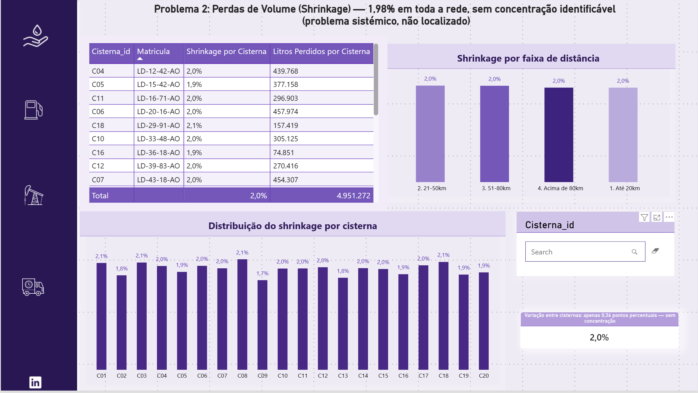
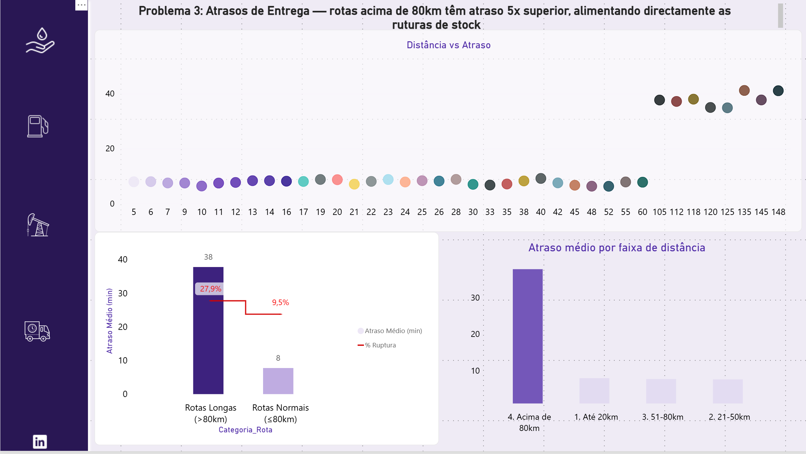

# 🛢️ Análise de Logística de Distribuição de Combustível

**Identificação e quantificação de ineficiências operacionais numa rede de distribuição downstream, através de um pipeline completo de dados: Excel/Power Query → SQL Server → Power BI.**

`SQL` `Power BI` `DAX` `Power Query` `ETL` `Análise de Dados`

---

## 📋 Sobre o projecto

Simulação completa de uma rede de distribuição de combustível — 5 terminais de armazenagem, 40 postos de venda e 20 cisternas, ao longo de 24 meses de operação — desenhada para reproduzir e investigar 3 problemas operacionais reais e recorrentes no sector petrolífero:

1. **Ruturas de stock** nos postos de combustível
2. **Perdas de volume (shrinkage)** no transporte terminal → posto
3. **Atrasos de entrega**, sobretudo em rotas de longa distância

Os dados são fictícios, mas construídos com regras de negócio realistas e calibrados estatisticamente — não gerados aleatoriamente sem critério.

## 🔍 Principais descobertas

| Problema | Dimensão | Impacto financeiro estimado (24 meses) |
|---|---|---|
| Ruturas de stock | 13,16% dos dias de operação | ~3,44 mil milhões Kz |
| Shrinkage | 1,98% do volume transportado | ~1,73 mil milhões Kz |
| Atrasos de entrega | 37 min em rotas longas (vs. 7 min normais) | Custo indirecto, via ruturas |

**A descoberta central:** as ruturas de stock e os atrasos de entrega partilham uma causa-raiz comum — a distância das rotas de distribuição. Postos servidos por rotas acima de 80km têm uma taxa de ruptura 3,6x superior e atrasos 5x superiores aos postos em rotas normais. O shrinkage, por contraste, é um problema sistémico sem concentração localizável — exigindo uma resposta operacional diferente.

📄 Análise completa e recomendações: [`Resumo_Executivo.pdf`](./documentos/Resumo_Executivo.pdf)

## 🛠️ Processo e stack técnico

**1. Modelação de negócio** — definição do fluxo terminal → cisterna → posto → venda, e desenho propositado dos 3 problemas a investigar, antes de qualquer construção de dados.

**2. Geração de dados — Excel / Power Query**
Construção de 8 tabelas relacionadas (+78.000 linhas), incluindo cálculo sequencial de stock diário via `List.Accumulate` — simula reabastecimento automático por gatilho de capacidade, réplica de lógica de negócio real.

**3. Base de dados relacional — SQL Server**
Esquema com chaves primárias/estrangeiras, ETL completo (resolução de formatos de data regionais, tipos de dados, duplicados), e queries de análise progressiva: *o que aconteceu → porquê → quanto custou*.
📄 Script completo: [`sql/LogisticaPetrolifera_Analise.sql`](./sql/LogisticaPetrolifera_Analise.sql)

**4. Dashboard interactivo — Power BI**
Modelo relacional com 12 relações, medidas DAX (incluindo `TREATAS` para análise cruzada entre tabelas sem relação directa), 4 páginas organizadas por problema de negócio.

## 📊 Dashboard https://app.powerbi.com/view?r=eyJrIjoiZDYwMTlkMjgtZDcxZi00ZDJkLTgwNWUtZWFjYjA4OGQ2YmI4IiwidCI6IjgyNWI5NmI2LTdhMDAtNDI4Ny05ZmRhLWQ4MWM4ZTJkZmNhYiJ9&pageName=0f4b8832540f8dd32a56

| Resumo Executivo | Ruturas de Stock |
|---|---|
|  |  |

| Shrinkage | Atrasos de Entrega |
|---|---|
|  |  |

## 📁 Estrutura do repositório

```
analise-logistica-petrolifera/
├── README.md
├── sql/
│   └── LogisticaPetrolifera_Analise.sql
├── documentos/
│   └── Resumo_Executivo.pdf
└── imagens/
    ├── dashboard_resumo.png
    ├── dashboard_ruturas.png
    ├── dashboard_shrinkage.png
    └── dashboard_atrasos.png
```

## 🧠 Competências demonstradas

Modelação de dados · ETL · SQL (JOINs, CTEs, agregações, análise de correlação) · Power Query (linguagem M, funções avançadas) · Power BI · DAX · Storytelling analítico · Pensamento crítico (formulação e descarte de hipóteses com base em dados)

---

**Autora:** Juliana Sacramento
📧 juliana@jucasmile.com · 🔗https://www.linkedin.com/in/juliana-sacramento-dados/  https://app.powerbi.com/view?r=eyJrIjoiZDYwMTlkMjgtZDcxZi00ZDJkLTgwNWUtZWFjYjA4OGQ2YmI4IiwidCI6IjgyNWI5NmI2LTdhMDAtNDI4Ny05ZmRhLWQ4MWM4ZTJkZmNhYiJ9&pageName=0f4b8832540f8dd32a56
